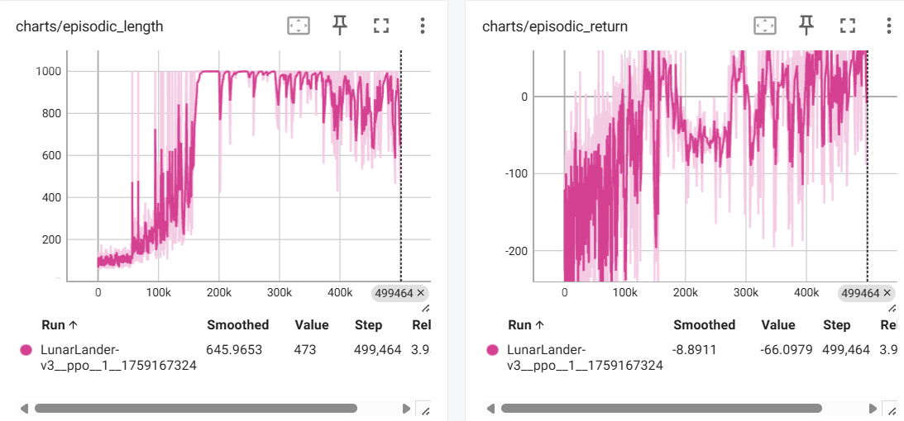

# HuggingFace Deep RL Course

Hands-on exercises for training reinforcement learning agents using Stable-Baselines3 and Gymnasium. See the official course here: [HuggingFace Deep RL Course](https://huggingface.co/learn/deep-rl-course/en/unit0/introduction)

## Installation

This project depends on `pygame==2.1.3`, which **is not compatible with Python 3.12 or later**.  

To avoid issues, please use **Python 3.11 or lower**. For example, you can create a virtual environment using Python 3.11:

```bash
uv init --python=python3.11
source .venv/bin/activate   # Linux/macOS
# or
.venv\Scripts\activate      # Windows
```

## Unit1: Hands-on PPO
Run the training script (it took ~24min on a GPU):
```bash
uv pip install -r unit1_hands_on/requirements-unit1.txt
python unit1_hands_on/ppo_lunarlander.py
```

## Bonus Unit1: Train Huggy
First, one needs to follow the instructions [here](https://huggingface.co/learn/deep-rl-course/en/unitbonus1/train) to install `ml-agents` and the `Huggy` environment. Once the dependencies are installed, 
go to `bonus_unit1_huggy`, and run
```bash
mlagents-learn ./Huggy.yaml --env=./trained-envs-executables/linux/Huggy/Huggy --run-id="Huggy" --no-graphics
```
It takes 32min to train, and GPU utilization seems quite low.

## Uni2: Hands-on Q-learning
```bash
uv pip install -r unit2_hands_on/requirements-unit2.txt
python unit2_hands_on/train_frozen_lake.py
python unit2_hands_on/train_taxi.py
```

## Unit3: DQN
```bash
uv pip install -r unit3_hands_on/requirements-unit3.txt
python -m rl_zoo3.train --algo dqn --env SpaceInvadersNoFrameskip-v4 -f logs/ -c unit3_hands_on/dqn.yml
```

## Unit4: Policy Gradient
```bash
uv pip install -r unit4_hands_on/requirements-unit4.txt
python unit4_hands_on/policy_gradient_cartpole.py
```

## Unit5: ML-agents
```bash
# Setup
mkdir -p unit5_hands_on/training-envs-executables/linux
cd unit5_hands_on
wget "https://github.com/huggingface/Snowball-Target/raw/main/SnowballTarget.zip" -O ./training-envs-executables/linux/SnowballTarget.zip
unzip -d ./training-envs-executables/linux/ ./training-envs-executables/linux/SnowballTarget.zip
chmod -R 755 ./training-envs-executables/linux/SnowballTarget
# Training
mlagents-learn ./SnowballTarget.yaml --env=./training-envs-executables/linux/SnowballTarget/SnowballTarget --run-id="SnowballTarget1" --no-graphics
mlagents-push-to-hf  --run-id=SnowballTarget1 --local-dir=./results/SnowballTarget1  --repo-id="user05181824/ppo-SnowballTarget" --commit-message="Train a Snowball agent with PPO"
```

## Unit6: A2C
```bash
uv pip install -r unit6_hands_on/requirements-unit6.txt
python unit6_hands_on/a2c_panda_reach.py
```

## Unit8-part1: PPO
```bash
uv pip install -r unit8_part1/requirements-unit8.txt
python unit8_part1/ppo.py --env-id="LunarLander-v3" --repo-id="user05181824/ppo-LunarLander-v3" --total-timesteps=500000
```

The above command takes ~4min to train the PPO agent on LunarLander-v3 (with a GPU). Once training is done, one may use `tensorboard` to visualize the results.


Note that given the network is tiny, training the agent on a CPU can be way faster ( `steps_per_second` increases from 2000 to 8000, a 4x speedup).